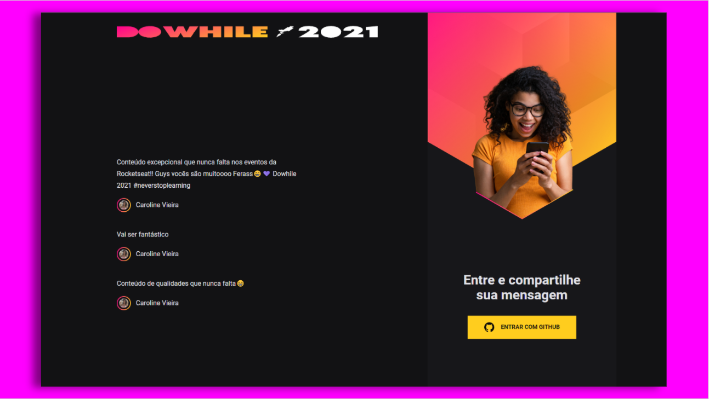

<h1 align="center">
  
</h1>


## 💻 Projeto
Aplicação desenvolvida para o evento DoWhile 2021, onde as pessoas podem acessar e compartilhar suas expectativas para o DoWhile. 

Nesta versão Web o usuário poderá realizar login via Github e após feito o login, enviar mensagens de expectativa para o evento.

Logado ou não, o usuário visualiza em tempo real as mensagens enviadas por outras pessoas dentro da aplicação. As mensagens serão exibidas continuamente e, conforme novas mensagens vão sendo recebidas, as anteriores vão sendo removidas de tela com um tempo de exibição mínimo de 3 segundos, ou seja, toda mensagem fica em tela no mínimo por esse tempo.

## ✨ Tecnologias

-   [ ] React Native
-   [ ] Typescript
-   [ ] Vite
-   [ ] Context API
-   [ ] React Icons VSC
-   [ ] CSS Module
-   [ ] Axios
-   [ ] Autenticação OAuth2 com Github
-   [ ] Expo Google Fonts
-   [ ] Deep Link
-   [ ] Socket.io
-   [ ] NodeJs
-   [ ] Prisma


## 🛠️ Requisitos Funcionais 

-   [ ] O usuário deve poder visualizar mensagens enviadas por todos membros em tempo-real;
-   [ ] O usuário deve poder realizar login via Github;
-   [ ] O usuário deve poder enviar uma mensagem de expectativa para o DoWhile;

## 💼 Regras de negócio

- [ ] O usuário só pode enviar mensagens após feito o login;
- [ ] As mensagens em tempo-real devem ficar no mínimo 3 segundos em tela;
- [ ] A mensagem deve possuir no máximo 140 caracteres;
- [ ] A mensagem não deve conter links ou qualquer tipo de formatação, a não ser textos;

## 🎉 Executando o projeto

Utilize o **yarn** ou o **npm install** para instalar as dependências do projeto.
Em seguida, inicie o projeto.

```cl
yarn dev
```

Lembre-se de criar as credencias do seu App no Github. Em seguida, defina no arquivo .env do back-end (remova o example do arquivo .env.example).

Na a API execute para gerar rodar as migrations:

```cl
yarn prisma migrate dev
```
Em seguida, execute o servidor com:
```cl
yarn dev
```

Lembre-se de atualizar o endereço IP no arquivo da api.ts da pasta service do App.

## 📄 Licença

Esse projeto está sob a licença MIT. Veja o arquivo [LICENSE](LICENSE.md) para mais detalhes.

<br />

<div align="center">
  <small>Feito por Caroline Vieira com 💜 </small>

</div>

